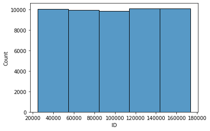
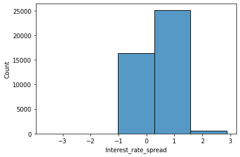

# Descriptive Statistics and Data Visualization

 In this project, I analyzed 2 dataset and visualized it using Python to gain useful insight from the plots.


 The first datasets contains students scores and the second is a banking dataset that contains customer information. 
 
 
<h1>Table of Contents<span class="tocSkip"></span></h1>
<div class="toc"><ul class="toc-item"><li><span><a href="#Problem-#A" data-toc-modified-id="Problem-#A-1"><span class="toc-item-num">1&nbsp;&nbsp;</span>Problem #A: Descriptive Statistics for the Final Scores of 4 Sections in a Data Science Course</a></span></li><li><span><a href="#Problem-#B" dasta-toc-modified-id="Problem-#B-2"><span class="toc-item-num">2&nbsp;&nbsp;</span>Problem #B: Exploratory Data Analysis and Visualization of a Bank’s Dataset   

 
 
# Metadata and Details


**Problem #A**

### Consider the given data related to the final scores of the four sections of a data science course: 


```python
Data = {
"Clytherin": [95, 95, 65, 70, 65, 65, 75, 75, 75, 80, 65, 95, 75, 65, 75, 80, 65, 95, 75, 65,
95, 75, 65, 80, 65, 70, 70, 65],
"Jriffindor": [81, 65, 73, 77, 70, 71, 74, 63, 85, 79, 86, 68, 75, 66, 62,
88, 83, 87, 64, 72, 69, 84, 78, 80, 76, 82, 67],
"Hufflebuff": [84, 77, 77, 61, 77, 84, 75, 89, 66, 75, 61, 66, 80, 61, 70,
66, 73, 89, 73, 70, 73, 70, 80, 84, 89, 80, 75],
"Ravenklaw": [75, 75, 75, 75, 75, 75, 75, 75, 75, 75, 75, 75, 75, 75, 75, 75, 75, 75, 75, 75,
75, 75, 75, 75, 75, 75, 75]
}
```

Answer the following questions:

*A*-1: Draw the histograms of scores for each of the above sections. Take bin size as 10 units, starting from score 40. Draw each histogram in one figure. Write the title on each histogram.

*A*-2: Find the mean, median and mode for each of the above sections.

*A*-3: Find the population variance and population standard deviation for each of the above sections.

*A*-4: Find the upper and lower quartile for each of the above sections.

*A*-5: Draw the box-plot for each of the above sections in one figure. Label x-axis with the name of the section.

*A*-6: Do hypothesis testing for each section to check if the data follows normal distribution. Assume p-value less than 0.05 or 5% as very small.

*A*-7: Do pair-wise student’s t-test to compare the means of two distribution. Set kwarg alternative=’two-sided’. Assume p-value less than 0.05 or 5% as very small.

*A*-8: Do pair-wise Mann-Whitney U test to compare the underlying distributions. Set kwarg alternative=’two-sided’. Assume p-value less than 0.05 or 5% as very small.


# Problem # A

## A-1


```python
#A-1: Draw the histograms of scores for each of the above sections
import matplotlib.pyplot as plt
import numpy as np
from scipy import stats

for section in Data: #dictionary’s default iterator is key
    series=Data[section].copy() # list is mutable, so we copy to avoid chages in actual data
    array = np.array(series)
    plt.figure()
    plt.hist(array,bins=[41,51,61,71,81,91,100])
    plt.title(f"{section} Histogram")
    plt.show()
```


    

    


    

    


    

    


    

    


## A-2


```python
#A-2: the mean, median and mode for each of the above sections
for section in Data: #dictionary’s default iterator is key
    series=Data[section].copy() # list is mutable, so we copy to avoid chages in actual data
    array = np.array(series)
    print(f"For {section}, the mean is {np.mean(array)}, the median is {np.median(array)}, and the mode is {stats.mode(array)[0][0]}")
```

    For Clytherin, the mean is 75.0, the median is 75.0, and the mode is 65
    For Jriffindor, the mean is 75.0, the median is 75.0, and the mode is 62
    For Hufflebuff, the mean is 75.0, the median is 75.0, and the mode is 61
    For Ravenklaw, the mean is 75.0, the median is 75.0, and the mode is 75
    

## A-3


```python
#A-3: The population variance and population standard deviation for each of the above sections
for section in Data: #dictionary’s default iterator is key
    series=Data[section].copy() # list is mutable, so we copy to avoid chages in actual data
    array = np.array(series)
    print(f"For {section}, the population variance is {np.round(np.var(array,ddof = 0),2)}, and the population standard deviation is {np.round(np.std(array,ddof = 0),2)}")
```

    For Clytherin, the population variance is 112.5, and the population standard deviation is 10.61
    For Jriffindor, the population variance is 60.67, and the population standard deviation is 7.79
    For Hufflebuff, the population variance is 68.0, and the population standard deviation is 8.25
    For Ravenklaw, the population variance is 0.0, and the population standard deviation is 0.0
    

## A-4


```python
#A-4: The upper and lower quartile for each of the above sections.
for section in Data: #dictionary’s default iterator is key
    series=Data[section].copy() # list is mutable, so we copy to avoid chages in actual data
    array = np.array(series)
    Q3, Q1 = np.percentile(array, [75 ,25])
    print(f"For {section}, the upper quartile is {Q3}, and the lower quartile is {Q1}")
```

    For Clytherin, the upper quartile is 80.0, and the lower quartile is 65.0
    For Jriffindor, the upper quartile is 81.5, and the lower quartile is 68.5
    For Hufflebuff, the upper quartile is 80.0, and the lower quartile is 70.0
    For Ravenklaw, the upper quartile is 75.0, and the lower quartile is 75.0
    

## A-5


```python
#A-5: The box-plot for each of the above sections in one figure.
fig = plt.figure(figsize=(6,8))
ax = fig.add_subplot(111)
plt.boxplot([Data["Clytherin"],Data["Jriffindor"],Data["Hufflebuff"],Data["Ravenklaw"]])
ax.set_xticklabels(["Clytherin", "Jriffindor","Hufflebuff","Ravenklaw"])
plt.title("Box plot")
plt.show()
```


    

    


## A-6


```python
#A-6: Hypothesis testing for each section to check if the data follows normal distribution
# Assuming p-value less than 0.05 or 5% as very small.
from scipy.stats import shapiro
print('The null hypthesis is:  "The samples follow a normal distribution"')
for section in Data: #dictionary’s default iterator is key
    series=Data[section].copy() # list is mutable, so we copy to avoid chages in actual data
    array = np.array(series)
    _,pval = shapiro(array)
    if pval <0.05:
        print(f"We reject the null hypothesis for {section}, since the p-value is {np.round(pval,3)}")
    else:
        print(f"We fail to reject the null hypothesis for {section}, since the p-value is {np.round(pval,3)}")
```

    The null hypthesis is:  "The samples follow a normal distribution"
    We reject the null hypothesis for Clytherin, since the p-value is 0.0
    We fail to reject the null hypothesis for Jriffindor, since the p-value is 0.334
    We fail to reject the null hypothesis for Hufflebuff, since the p-value is 0.304
    We fail to reject the null hypothesis for Ravenklaw, since the p-value is 1.0
    

    

## A-7


```python
#A-7: pair-wise student’s t-test to compare the means of two distribution
from scipy.stats import ttest_ind
print("The null hypthesis is:  'The means of the 2 samples are equal', using Student's t-test ")
for section in Data: #dictionary’s default iterator is key
    series=Data[section].copy() # list is mutable, so we copy to avoid chages in actual data
    array = np.array(series)
    count = 0
    for section1 in Data:
        if (section1 != section and section!= "Ravenklaw"):
            count+=1
            if (section == "Hufflebuff"):
                if (count == 1 or count == 2):
                    continue
            if (section == "Jriffindor"):
                if (count == 1):
                    continue 
            series1=Data[section1].copy()
            array1 = np.array(series1)
            _,pval = ttest_ind(array,array1,equal_var=False)
            if pval <0.05:
                print(f"For {section} and {section1}: We reject the null hypothesis, since the p-value is {np.round(pval,3)}")
            else:
                print(f"For {section} and {section1}: We fail to reject the null hypothesis, since the p-value is {np.round(pval,3)}")
```

    The null hypthesis is:  'The means of the 2 samples are equal', using Student's t-test 
    For Clytherin and Jriffindor: We fail to reject the null hypothesis, since the p-value is 1.0
    For Clytherin and Hufflebuff: We fail to reject the null hypothesis, since the p-value is 1.0
    For Clytherin and Ravenklaw: We fail to reject the null hypothesis, since the p-value is 1.0
    For Jriffindor and Hufflebuff: We fail to reject the null hypothesis, since the p-value is 1.0
    For Jriffindor and Ravenklaw: We fail to reject the null hypothesis, since the p-value is 1.0
    For Hufflebuff and Ravenklaw: We fail to reject the null hypothesis, since the p-value is 1.0
    


**Problem #B**

Consider the data given in CSV file **Bank Info**. Do the following tasks using the data:

*B*-1: Draw the histograms of all numeric and non-numeric columns.

*B*-2: Using the histograms generated in *B*-1, provide descriptive comments on the distribution of the following columns: loan amount, rate of interest, loan type, and property value

*B*-3: Draw a plot between **loan amount** and **Gender**. What can you conclude from the plot?

*B*-4: Draw a plot between **property value** and **loan amount**, differentiated by **Status**. For the de- faulted loans, what is the relationship between **property value** and **loan amount**. (*Note: **status** of 1 indicates that the loan has defaulted.*)

*B*-5: Draw a plot between **property value** and **loan amount**, differentiated by **Status** and **Region**. Make the figsize=(9,4), and dpi=200. 

*B*-6: Display a count plot of **credit type**, differentiated by **loan purpose**.

*B*-7: Draw a plot on the **loan amount** differentiated by **business or commercial** and **occupancy type**.

*B*-8: Add two new columns to the data frame with headers: **property value multiple** and **loan multiple**. The values in the new columns can be calculated using the following formulas:

property value multiple = property value /  (*income ×* 12)

loan multiple = loan amount /  (*income ×* 12)

*B*-9: Plot the **Credit Score** in ascending order on the x-axis, and the above two new columns on y-axis


# Problem # B
### Consider the data given in the CSV file and do the following tasks:

## B-1


```python
#B-1: Draw the histograms of all numeric and non-numeric columns.## B-3

%matplotlib inline
# To load all the needed libraries
import pandas as pd  #for reading the csv file
import matplotlib.pyplot as plt
import seaborn as sns

df = pd.read_csv('Bank Info.csv') 

# Identifying numeric columns
num_columns = df.select_dtypes(exclude='object').columns

print('Histograms of all numeric columns:')
for c in num_columns:
    plt.figure()
    sns.histplot(x=c,bins=5,data=df);
    plt.show()
print('*'*70)

# Identifying non-numeric columns
cat_columns = df.select_dtypes('object').columns

print('Histograms of all non-numeric columns:')
for c in cat_columns:
    plt.figure()
    sns.countplot(y=c,data=df);
    plt.show()
```

    Histograms of all numeric columns:
    


    

    


    

    


    

    


    

    


    

    


    

    


    

    


    

    


    

    


    

    


    

    


    

    


    

    


    **********************************************************************
    Histograms of all non-numeric columns:
    


    

    


    

    


    

    


    

    


    

    


    

    


    

    


    

    


    

    


    

    


    

    


    

    


    

    


    

    


    

    


    

    


    

    


    

    


    

    


    

    


    

    


## B-2


```python
# B-2: provide descriptive comments on the distribution of the following columns:
#ˆ loan amount
#ˆ rate of interest
#ˆ loan type
#ˆ property value 

#Description on loan_amount histogram:
print("""For the loan_amount histogram, it does not seem to follow a normal
distribution, it's positively skewed, and the mode is around 0.3\n""")

#Description on rate_of_interest histogram:
print("""For the rate_of_interest histogram, its distribution is similar to
a normal distribution and the mode is around 4\n""")

#Description on loan_type histogram:
print("""For the loan_type histogram, it does not seem to follow a normal
distribution, it's positively skewed, and the mode is Type1\n""")

#Description on property_value histogram:
print("""For the property_value histogram, its distribution is similar to
a normal distribution, but it is slighetly positively skewed, and the mode
is approximately 0.3""")
```

    For the loan_amount histogram, it does not seem to follow a normal
    distribution, it's positively skewed, and the mode is around 0.3
    
    For the rate_of_interest histogram, its distribution is similar to
    a normal distribution and the mode is around 4
    
    For the loan_type histogram, it does not seem to follow a normal
    distribution, it's positively skewed, and the mode is Type1
    
    For the property_value histogram, its distribution is similar to
    a normal distribution, but it is slighetly positively skewed, and the mode
    is approximately 0.3
    

## B-3


```python
#B-3: Draw a plot between loan amount and Gender. What can you conclude from the plot?

plt.figure()
sns.boxplot(y='loan_amount',x='Gender',data=df)
plt.show()

print("""As can be seen from the box-plot below, 'joint' group is the mode and it has the maximum median, max value and min value. Moreover, males' loans are slightly more than females (i.e., the median, max value, and min value for males are all slightly higher than those for females)""")
```


    

    


    As can be seen from the box-plot below, 'joint' group is the mode and it has the maximum median, max value and min value. Moreover, males' loans are slightly more than females (i.e., the median, max value, and min value for males are all slightly higher than those for females)
    

## B-4


```python
#B-4: Draw a plot between property value and loan amount, differentiated by Status. 
#(Note: A status of 1 indicates that the loan has defaulted.)

plt.figure(figsize=(8,7))
sns.scatterplot(x ='property_value', y ='loan_amount', hue='Status',
                alpha=0.8, color='blue', data=df)
plt.title('Property Value vs Loan Amount')

print("""it can be seen from the graph that there is a proportional relationship
between property value and property loan, the higher the value of the 
property,the higher the loan amount taken. Also, the graph shows that
most of loans have defaulted for lower amount of loans taken for properties
with lower values""")
```

    it can be seen from the graph that there is a proportional relationship
    between property value and property loan, the higher the value of the 
    property,the higher the loan amount taken. Also, the graph shows that
    most of loans have defaulted for lower amount of loans taken for properties
    with lower values
    


    

    


## B-5


```python
#B-5: Draw a plot between property value and loan amount, differentiated by Status and Region.


plt.figure(figsize=(9,4), dpi=200)
ax = sns.scatterplot(x ='property_value', y ='loan_amount', hue='Status',
               style='Region', alpha=0.8, color='blue', data=df) #scatter plot differentiated by Status and Region
plt.title('Property Value vs Loan Amount')
```


    Text(0.5, 1.0, 'Property Value vs Loan Amount')


    

    


## B-6


```python
#B-6: Display a count plot of credit type, differentiated by loan purpose.

plt.figure(figsize=(5,5))
ax = sns.countplot(y='credit_type',hue='loan_purpose',data=df) 
plt.title('Credit Types')
plt.show()
```


    

    


## B-7


```python
#B-7: Draw a plot on the loan amount dierentiated by business or commercial and occupancy type.


plt.figure()
sns.barplot(x='business_or_commercial', y='loan_amount', hue='occupancy_type',data=df)
plt.title('sources of loans') #barplot for loan amount differentiated by (business or commercial)
plt.show()

```


    

    


## B-8


```python
#B-8: Add two new columns to the dataframe with headers: property value multiple and loan multiple. 
# The values in the new columns can be calculated using the formulas (Check the pdf file):

#to add the first new column (property value multiple)
df['property value multiple']=df['property_value']/(df['income']*12)

#to add the second new column (loan multiple)
df['loan multiple']=df['loan_amount']/(df['income']*12)

#to show the data with the new clolumns
display(df.head())
```


<table border="1" class="dataframe">
  <thead>
    <tr style="text-align: right;">
      <th></th>
      <th>ID</th>
      <th>year</th>
      <th>loan_limit</th>
      <th>Gender</th>
      <th>approv_in_adv</th>
      <th>loan_type</th>
      <th>loan_purpose</th>
      <th>Credit_Worthiness</th>
      <th>open_credit</th>
      <th>business_or_commercial</th>
      <th>...</th>
      <th>co-applicant_credit_type</th>
      <th>age</th>
      <th>submission_of_application</th>
      <th>LTV</th>
      <th>Region</th>
      <th>Security_Type</th>
      <th>Status</th>
      <th>dtir1</th>
      <th>property value multiple</th>
      <th>loan multiple</th>
    </tr>
  </thead>
  <tbody>
    <tr>
      <th>0</th>
      <td>142513</td>
      <td>2019</td>
      <td>cf</td>
      <td>Not Available</td>
      <td>pre</td>
      <td>type1</td>
      <td>p4</td>
      <td>l1</td>
      <td>nopc</td>
      <td>nob/c</td>
      <td>...</td>
      <td>CIB</td>
      <td>25-34</td>
      <td>to_inst</td>
      <td>68.540670</td>
      <td>south</td>
      <td>direct</td>
      <td>0</td>
      <td>49.0</td>
      <td>7.079946</td>
      <td>4.852642</td>
    </tr>
    <tr>
      <th>1</th>
      <td>55909</td>
      <td>2019</td>
      <td>cf</td>
      <td>Joint</td>
      <td>nopre</td>
      <td>type1</td>
      <td>p4</td>
      <td>l1</td>
      <td>nopc</td>
      <td>nob/c</td>
      <td>...</td>
      <td>EXP</td>
      <td>35-44</td>
      <td>not_inst</td>
      <td>65.681004</td>
      <td>south</td>
      <td>direct</td>
      <td>0</td>
      <td>40.0</td>
      <td>10.472973</td>
      <td>6.878754</td>
    </tr>
    <tr>
      <th>2</th>
      <td>148379</td>
      <td>2019</td>
      <td>cf</td>
      <td>Not Available</td>
      <td>nopre</td>
      <td>type1</td>
      <td>p4</td>
      <td>l1</td>
      <td>nopc</td>
      <td>nob/c</td>
      <td>...</td>
      <td>CIB</td>
      <td>35-44</td>
      <td>not_inst</td>
      <td>53.820961</td>
      <td>south</td>
      <td>direct</td>
      <td>0</td>
      <td>21.0</td>
      <td>6.001048</td>
      <td>3.229822</td>
    </tr>
    <tr>
      <th>3</th>
      <td>27049</td>
      <td>2019</td>
      <td>cf</td>
      <td>Not Available</td>
      <td>nopre</td>
      <td>type1</td>
      <td>p3</td>
      <td>l1</td>
      <td>nopc</td>
      <td>nob/c</td>
      <td>...</td>
      <td>CIB</td>
      <td>55-64</td>
      <td>to_inst</td>
      <td>30.603448</td>
      <td>south</td>
      <td>direct</td>
      <td>0</td>
      <td>28.0</td>
      <td>9.863946</td>
      <td>3.018707</td>
    </tr>
    <tr>
      <th>4</th>
      <td>105220</td>
      <td>2019</td>
      <td>cf</td>
      <td>Joint</td>
      <td>nopre</td>
      <td>type1</td>
      <td>p4</td>
      <td>l1</td>
      <td>nopc</td>
      <td>nob/c</td>
      <td>...</td>
      <td>EXP</td>
      <td>65-74</td>
      <td>not_inst</td>
      <td>73.119122</td>
      <td>North</td>
      <td>direct</td>
      <td>0</td>
      <td>24.0</td>
      <td>4.688419</td>
      <td>3.428131</td>
    </tr>
  </tbody>
</table>
<p>5 rows × 36 columns</p>
</div>


## B-9


```python
#B-9: Plot the Credit Score in ascending order on the x-axis, and the above two new columns on y-axis

sel_columns=['property value multiple','loan multiple','Credit_Score']
ndf = df.loc[:,sel_columns]
ndf.set_index('Credit_Score',inplace=True)
ndf.sort_index(inplace=True)

plt.figure(figsize=(25,10))
sns.lineplot(markers=True, data=ndf)
plt.show()
```

    


    

    


## 🛠 Skills Used
Python,

Data Visualization: histograms, box plots, count plots, scatter plots, line plots

Descriptive statistical analysis: calculating the measures of central tendency, the measures of data dispersion, and hypothesis testing.
## 🚀 About Me
👋 Hi, I’m @Raed-Alshehri

👀 I’m interested in data science, machine learning, and statistics.

🌱 I’m applying my skills in the data analytics field using Python, R, and SQL


## 🔗 Links
[](https://raed-alshehri.github.io/RaedAlshehri.github.io/)
[](https://www.linkedin.com/in/raedalshehri/)


## Feedback

If you have any feedback, please reach out to me at alshehri.raeda@gmail.com
